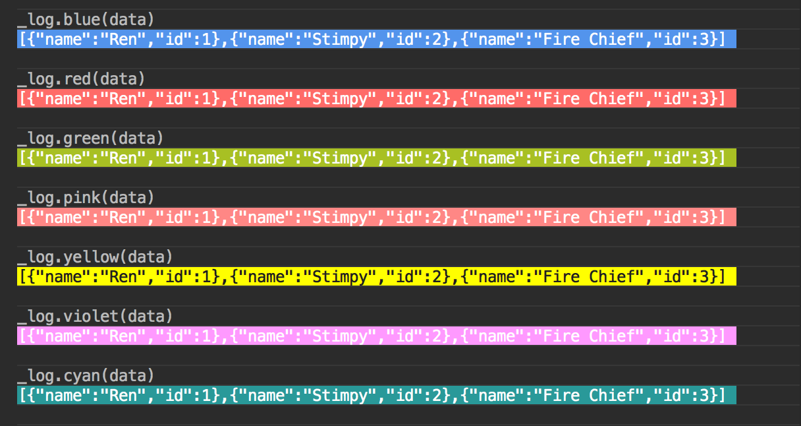

# log_log

```console
npm install @flavioespinoza/log_log --save
```

Require it in your Node app.

```javascript
const _log = require('@flavioespinoza/log_log')._log
const log = require('@flavioespinoza/log_log').log
```

Define your data.
```javascript
const data = [
	{
		'name': 'Ren',
		'id': 1
	},
	{
		'name': 'Stimpy',
		'id': 2
	},
	{
		'name': 'Fire Chief',
		'id': 3
	}
]

_log.deep(data) //=> See outputs below in Node console

```

## Alerts

Use _log.alert_name() to show different levels of priority.


## Background Colors

Use _log.background_color_name() to show data with background color.




## Text Colors

Use log.color_name() without the underscore to color text with no background.


