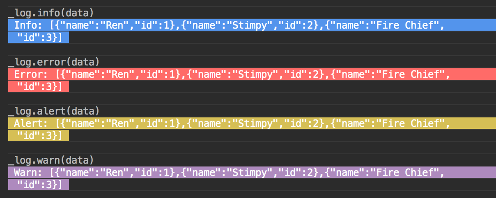

# Log_Log

Color logs for node console

### Install

##### Note: This is a `esm` ready module which can be imported without the use of `yarn` or `npm`

`esm` is a fast, production ready, zero-dependency ES module loader for Node 6+!

Read about it: [Tomorrow’s ES Modules Today!](https://medium.com/web-on-the-edge/tomorrows-es-modules-today-c53d29ac448c)

ES Module Loader on Github: [esm](https://github.com/standard-things/esm)


---
yarn

```shell
yarn add @flavioespinoza/log_log
```


npm
```shell
npm i @flavioespinoza/log_log
```

Require it in your Node app using the new esm module by 
```javascript

// esm or typescript
import { _log, log } from '@flavioespinoza/log_log'
```

or 

```javascript
// require
const _log = require('@flavioespinoza/log_log')._log
const log = require('@flavioespinoza/log_log').log
```

### Deep (Nested Objects)

```javascript

_log.info([{prop: 'value', nested: { nested_prop: 'nested value' }}])

```

```javascript

const data = [
	{
		'name': 'Ren',
		'id': 1,
		'preferences': {
			'food': 'steak',
			'drink': 'bourbon',
			'ice_cream': 'soap bar',
			'favorite_episode': 'Space Madness',
			'hobbies': {
				'sports': ['soccer', 'bad mitten'],
				'dancing': ['salsa', 'bachata'],
				'music': {
					'alternative': ['Pearl Jam', 'Nirvana'],
					'glam_rock': ['Mötley Crüe', 'Poison'],
					'country': ['Johnny Cash', 'George Strait']
				}
			}
		}
	}
]

_log.deep(data) //=> See console output below...

```

`_log.deep` will show the complete data structure no matter how deep the nested object is.


Normal console.log(data) does not show nested data past 2 levels deep.


### Alerts

Use _log.alert_name() to show different levels of priority.

```javascript
    _log.info(data)
```

```javascript
    _log.error(data)
```

```javascript
    _log.alert(data)
```

```javascript
    _log.warn(data)
```




### Background Colors

Use _log.background_color_name() to show data with background color.

```javascript
    _log.blue(data)
```

```javascript
    _log.red(data)
```

```javascript
    _log.green(data)
```

```javascript
    _log.pink(data)
```

```javascript
    _log.yellow(data)
```

```javascript
    _log.violet(data)
```

```javascript
    _log.cyan(data)
```


## Text Colors

Use log.color_name() without the underscore to color text with no background.

```javascript
    log.blue(data)
```

```javascript
    log.red(data)
```

```javascript
    log.green(data)
```

```javascript
    log.yellow(data)
```

```javascript
    log.cyan(data)
```

```javascript
    log.magenta(data)
```

```javascript
    log.black(data)
```


### Timer

Use _log.timer(method, method_name) to log how long a function takes to return.

```javascript
    function do_stuff () {
    	let res = []
    	for (let i = 0; i < 100000; i++) {
    		res.push(i)
    	}
    	return res
    }


    _log.timer(do_stuff, 'Do Stuff')

```


